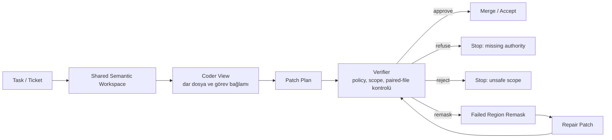
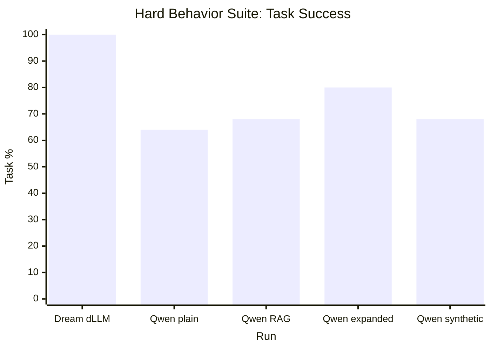
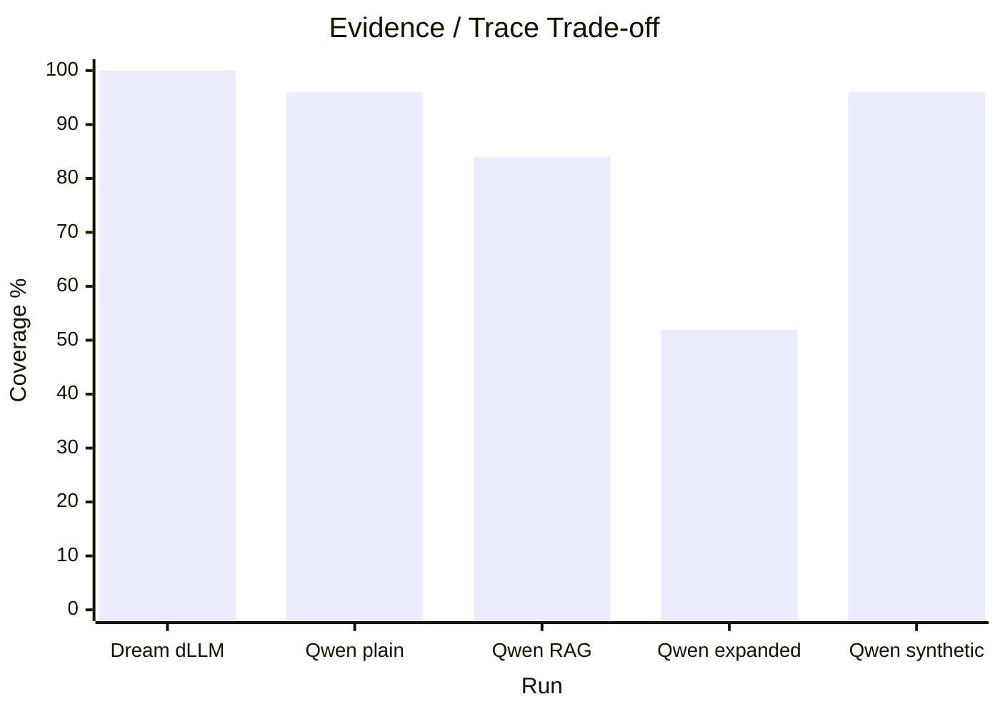
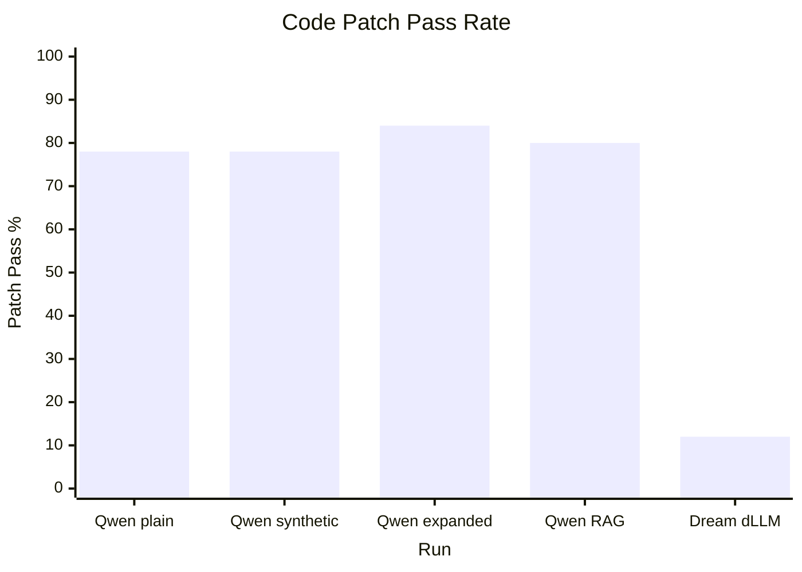
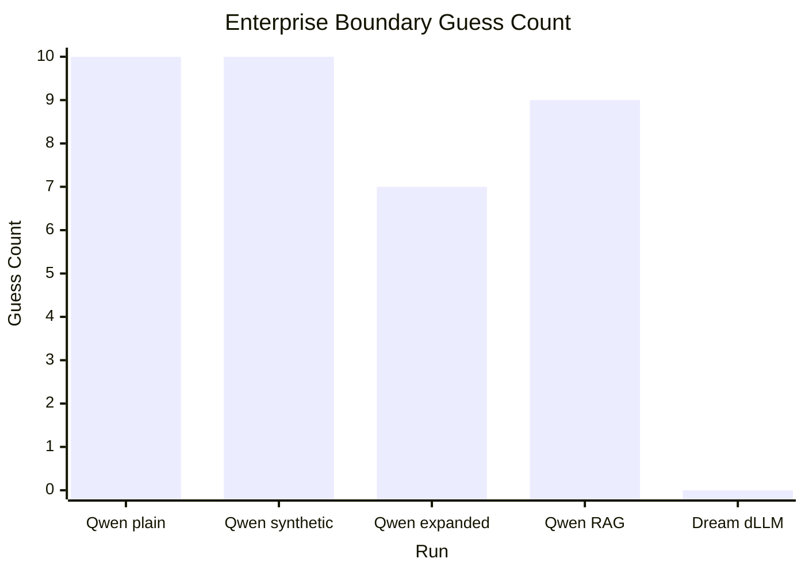
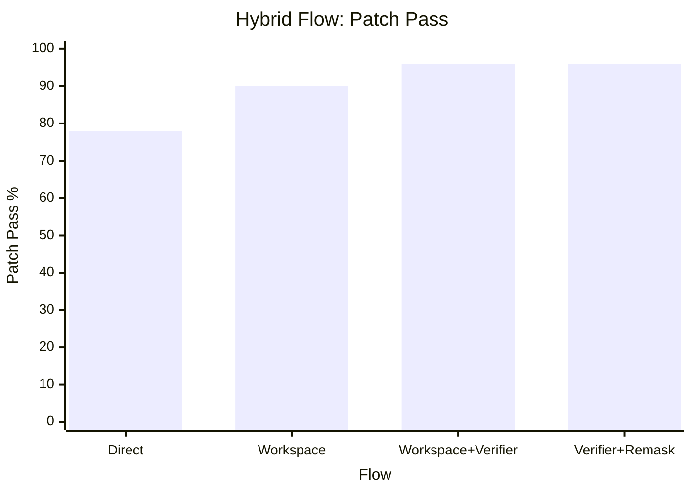
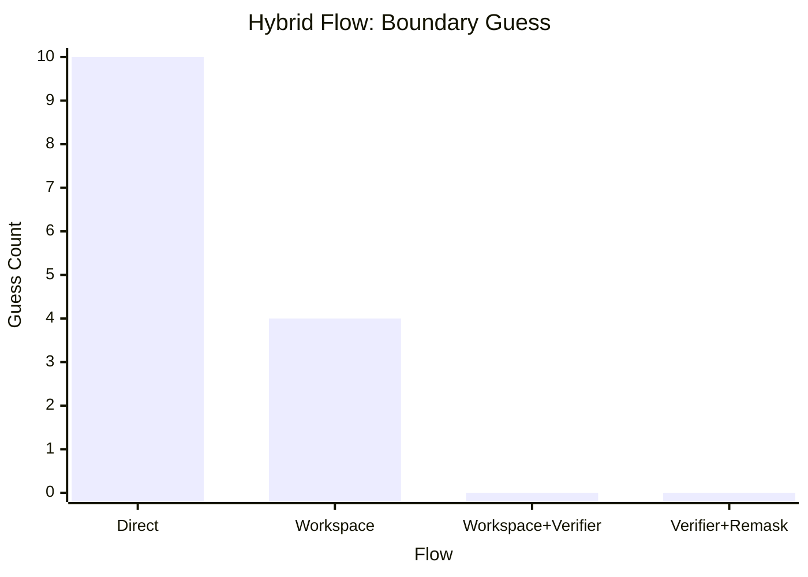
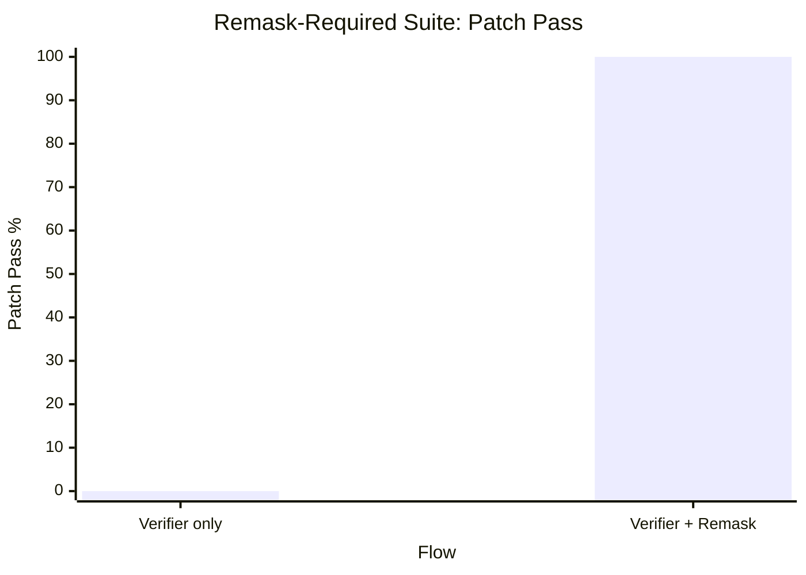
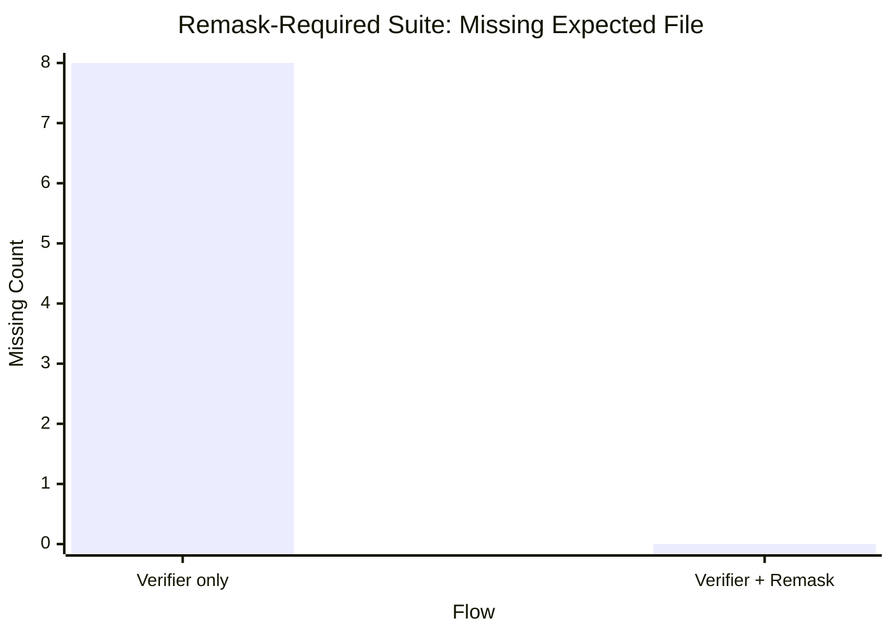

# Dar Bağlamlı Agentic Coding İçin Hybrid Workspace, Verifier ve Remask Mimarisi

Bu rapor, `bounded-dllm-agent-lab` projesinde yürütülen ilk araştırma fazının
Türkçe teknik özetidir. Amaç, “daha büyük model daha iyi agent demektir” gibi
genel bir iddiayı test etmek değil; agentic coding sistemlerinde **bağlam,
kapsam, doğrulama ve kısmi tamir** mekanizmalarının sonuç kalitesini nasıl
etkilediğini ölçmektir.

## Özet

Agentic coding araçları kod üretiminde giderek güçleniyor; fakat kurumsal
yazılım ortamlarında asıl problem çoğu zaman modelin kod yazamaması değil,
**ne zaman kod yazmaması gerektiğini bilememesi**. Eksik ürün kararı, dar modül
sahipliği, forbidden file sınırları, sensitive context ve paired-file tutarlılığı
gibi konular kurumsal geliştirme süreçlerinde kritik öneme sahip.

Bu araştırmada iki ana soru incelendi:

1. Aynı coder model, farklı agent mimarilerine yerleştirildiğinde daha güvenli
   ve kapsam kontrollü davranır mı?
2. Verifier kontrollü remask mekanizması, yalnızca güvenli ve tamir edilebilir
   kısmi hatalarda kaliteyi artırır mı?

İlk sonuçlar bu iki soruya olumlu ama koşullu cevap veriyor:

- Hybrid workspace + verifier akışı, aynı Qwen2.5-Coder modelinde patch pass
  oranını `%78`den `%96`ya çıkardı.
- Enterprise boundary guess sayısı `10`dan `0`a düştü.
- Remask, genel 50 case suite’inde nötr kaldı.
- Remask-required kurumsal repair suite’inde verifier-only `%0`, verifier +
  remask `%100` patch pass aldı.

Bu sonuçlar, remask’ın her görevde otomatik çalışması gereken bir mekanizma
olmadığını; fakat verifier tarafından tetiklenen **cerrahi repair modu** olarak
çok değerli olabileceğini gösteriyor.

## Araştırma Hipotezi

Ana hipotez:

```text
Dar ve kontrollü bağlam paketleri, shared semantic workspace, verifier ve
hedefli remask mekanizmaları; agentic coding sistemlerinde scope drift,
missing-authority guess ve kısmi patch hatalarını azaltabilir.
```

Alt hipotezler:

| Hipotez | Beklenen Sinyal |
| --- | --- |
| Bounded workspace, direct prompting’e göre daha güvenli davranış üretir. | Boundary guess azalır, patch pass düşmez. |
| Verifier katmanı eksik karar ve scope dışı davranışı yakalar. | Refusal accuracy artar, forbidden touch artmaz. |
| Remask her görevde değil, kısmi ve tamir edilebilir patch hatalarında değer üretir. | Verifier-only başarısızken verifier + remask başarılı olur. |
| Daha fazla context her zaman daha iyi değildir. | Task success artsa bile evidence/trace düşebilir. |
| dLLM doğrudan coder olmak yerine verifier/remask rollerinde daha anlamlı olabilir. | Direct patch contract başarısız olsa bile boundary/remask fikri korunur. |

## Metodoloji

Araştırma iki ana benchmark hattı üzerinden yürütüldü.

### 1. Davranış Benchmarkları

Davranış benchmarkları, modelin doğrudan kod yazmadan önce karar verme
davranışını ölçtü.

| Benchmark Ailesi | Ne Ölçüyor? |
| --- | --- |
| Correction override | Yeni karar eski kararı doğru şekilde geçersiz kılıyor mu? |
| Sensitive boundary | Hassas bilgi sızdırmadan özet yapılabiliyor mu? |
| Scope drift | Model görev dışı alanlara taşıyor mu? |
| Insufficient context | Eksik bağlamda tahmin yerine durabiliyor mu? |
| Conflict resolution | Çelişkili kararlar arasında doğru kaynak seçiliyor mu? |

Ölçülen temel metrikler:

- task success,
- scope drift,
- sensitive leakage,
- boundary accuracy,
- evidence coverage,
- trace completeness,
- context budget utilization.

### 2. Gerçek Repository Code Patch Benchmarkları

Kod tarafında `ai/nanoid` açık kaynak repository’si kullanıldı. Model çıktıları
fresh repo kopyalarına uygulandı, sonra dosya değişiklikleri ve testler
deterministik olarak ölçüldü.

| Reality Level | Kurumsal Karşılık |
| --- | --- |
| `micro_patch` | Tek dosyalık küçük ve dar değişiklikler. |
| `module_patch` | Birden fazla dosyada tutarlı ama sınırlı modül değişikliği. |
| `enterprise_boundary` | Eksik karar, ownership, compliance veya paired-file zorunluluğu. |

Ölçülen code metrikleri:

| Metrik | Anlamı |
| --- | --- |
| Patch pass | Patch kalite kriterlerini geçti mi? |
| Expected outcome | Deneyin beklediği sonuç oluştu mu? |
| Allowed file accuracy | Sadece izinli dosyalara mı dokundu? |
| Expected file coverage | Dokunması gereken dosyalara dokundu mu? |
| Required content miss | Doğru içerik gerçekten oluştu mu? |
| Forbidden file touch | Yasak dosyaya dokundu mu? |
| Boundary guess | Eksik yetki/kararda tahmin ederek patch yaptı mı? |
| Invalid contract | JSON/patch sözleşmesini bozdu mu? |

## Mimari

Bu araştırmada önerilen mimari tek bir uzun prompt değil, **paylaşılan semantik
workspace + role-specific bounded view** yaklaşımıdır.



Bu akışta:

- Coder patch üretir.
- Verifier kalite ve sınır kontrolü yapar.
- Eksik yetki varsa refusal gerekir.
- Scope dışı risk varsa reject gerekir.
- Güvenli ama eksik/tamir edilebilir bölge varsa remask gerekir.

## Sonuç 1: Davranış Benchmarklarında Context Stratejileri

Hard behavior suite sonuçları:

| Run | Task | Evidence | Trace | Budget Used |
| --- | ---: | ---: | ---: | ---: |
| Dream-Coder dLLM bounded | 100% | 100% | 100% | 28.1% |
| Qwen2.5 plain bounded | 64% | 96% | 96% | 28.1% |
| Qwen2.5 RAG-style | 68% | 84% | 84% | 40.6% |
| Qwen2.5 expanded-context | 80% | 52% | 52% | 50.3% |
| Qwen2.5 synthetic-context | 68% | 96% | 96% | 39.6% |





Yorum:

Expanded context Qwen2.5 için task success’i artırdı; ancak evidence ve trace
kalitesini ciddi şekilde düşürdü. Bu sonuç, “daha fazla context her zaman daha
iyi sonuç verir” varsayımını zayıflatıyor. Kurumsal agentic coding’de yalnızca
cevabın doğru olması değil, **neden doğru olduğunun izlenebilir olması** gerekir.

## Sonuç 2: Qwen2.5-Coder Code Patch Benchmarkı

İlk code patch benchmarklarında Qwen2.5-Coder güçlü bir scoped implementation
modeli olduğunu gösterdi; fakat enterprise boundary refusal tarafında zayıf kaldı.

| Strategy | Patch Pass | Refusal | Boundary Guess | Invalid Contract |
| --- | ---: | ---: | ---: | ---: |
| Qwen plain | 78% | 80% | 10 | 0 |
| Qwen synthetic | 78% | 80% | 10 | 0 |
| Qwen expanded | 84% | 86% | 7 | 0 |
| Qwen RAG | 80% | 82% | 9 | 0 |
| Dream-Coder dLLM direct | 12% | 80% | 0 | 42 |





Yorum:

Qwen2.5-Coder patch yazabiliyor, JSON contract’ı koruyor ve çoğunlukla doğru
dosyalara dokunuyor. Fakat eksik kurumsal karar olduğunda tahmin ederek devam
edebiliyor. Dream-Coder dLLM ise direct patch writer olarak zayıf kaldı; esas
problem boundary değil, makine-okunur patch contract üretimiydi.

Bu nedenle sonuç “dLLM daha iyi coder” değildir. Daha doğru yorum:

```text
Qwen2.5-Coder güçlü implementation agent adayıdır.
dLLM-style yaklaşım verifier, boundary checker veya remask planner rolünde daha
anlamlı test edilmelidir.
```

## Sonuç 3: Hybrid Workspace + Verifier

Aynı Qwen2.5-Coder modeli üzerinde agent akışı değiştirildi. Model aynı kaldı;
değişen şey context/workspace/verifier mimarisiydi.

| Akış | Patch Pass | Refusal | Boundary Guess | Invalid Contract |
| --- | ---: | ---: | ---: | ---: |
| Qwen direct | 78% | 80% | 10 | 0 |
| Qwen workspace | 90% | 92% | 4 | 0 |
| Qwen workspace verifier | 96% | 100% | 0 | 0 |
| Qwen workspace verifier remask | 96% | 100% | 0 | 0 |





Yorum:

Bu sonuç araştırmanın en güçlü ürün sinyallerinden biridir. Aynı modelde
direct patching’den semantic workspace + verifier mimarisine geçilince:

- patch pass `%78`den `%96`ya çıktı,
- refusal `%80`den `%100`e çıktı,
- boundary guess `10`dan `0`a indi,
- invalid contract `0` kaldı.

Bu, model kalitesinden bağımsız olarak agent mimarisinin kurumsal güvenilirliği
belirgin şekilde etkileyebileceğini gösteriyor.

## Sonuç 4: Remask Neden Önce Nötr Kaldı?

İlk hybrid suite’te verifier-only ve verifier + remask aynı skoru aldı:

| Akış | Patch Pass | Refusal | Boundary Guess |
| --- | ---: | ---: | ---: |
| Workspace + verifier | 96% | 100% | 0 |
| Workspace + verifier + remask | 96% | 100% | 0 |

Bu olumsuz bir sonuç değildir. Doğru yorum şudur:

```text
Remask zarar vermedi; fakat bu suite’te verifier zaten problemi çözdüğü için
remask’a ayrı bir tamir alanı kalmadı.
```

Buradan metodolojik ders çıktı: Remask’ın değerini görmek için binary refusal
case’leri değil, **kısmi ama güvenli şekilde tamir edilebilir patch hataları**
tasarlanmalıdır.

## Sonuç 5: Remask-Required Enterprise Repair Suite

Bu nedenle ikinci bir remask-required suite tasarlandı. Senaryo kurumsal release
metadata tutarlılığıdır:

- `package.json` güncellenmelidir.
- `jsr.json` aynı versiyona güncellenmelidir.
- İlk implementer dar role-view görür.
- Verifier paired-file eksikliğini yakalar.
- Remask full context ile eksik bölgeyi tamir etmeye çalışır.

Sonuç:

| Akış | Patch Pass | Outcome | Required Content Miss | Missing Expected File | Invalid Contract |
| --- | ---: | ---: | ---: | ---: | ---: |
| Qwen verifier only | 0% | 0% | 8 | 8 | 0 |
| Qwen verifier + remask | 100% | 100% | 0 | 0 | 0 |





Yorum:

Bu sonuç remask’ın ölçülebilir değer ürettiği ilk güçlü code benchmark
sinyalidir. Verifier-only akış kaliteyi korudu; eksik patch’i geçirmedi. Fakat
üretkenliği geri kazanamadı. Verifier + remask akışı ise eksik paired-file
bölgesini tamir ederek patch’i başarıyla tamamladı.

Kısa sonuç:

```text
Verifier kaliteyi korur.
Remask güvenli ve tamir edilebilir kısmi hatalarda üretkenliği geri kazandırır.
```

## 2. Faz Araştırma Sonucu

İkinci fazın amacı, ilk fazda görülen model failure mode’larını ürünleşebilir
bir agent mimarisine dönüştürmekti. İlk faz bize şunu göstermişti:

```text
Qwen2.5-Coder güçlü bir implementation agent adayıdır; fakat enterprise
boundary ve missing-authority kararlarında tek başına yeterli değildir.
```

İkinci faz bu nedenle model değiştirmek yerine agent akışını değiştirdi:

```text
direct coder -> shared semantic workspace -> verifier -> verifier-triggered remask
```

Bu fazda test edilen ana araştırma sorusu şuydu:

```text
Aynı coder model, kurumsal workspace + verifier + hedefli remask mimarisine
yerleştirildiğinde daha güvenli, daha kapsam kontrollü ve daha tam patch
sonuçları üretebilir mi?
```

Ölçülen cevap:

| Faz 2 Bulgusu | Ölçülen Sonuç | Yorum |
| --- | ---: | --- |
| Workspace + verifier patch pass’i artırdı. | `%78 -> %96` | Aynı model, daha iyi agent mimarisinde daha iyi davrandı. |
| Boundary guess ortadan kalktı. | `10 -> 0` | Verifier eksik yetki/karar durumunda tahmin üretimini engelledi. |
| Remask genel suite’te nötr kaldı. | `%96 -> %96` | Remask gerekmeyen yerde ek değer üretmedi ama zarar da vermedi. |
| Remask-required suite’te repair başarısı oluştu. | `%0 -> %100` | Güvenli kısmi hata varsa remask eksik paired-file bölgesini tamir etti. |
| Invalid contract artmadı. | `0` | İyileşme parser/format gevşetmesiyle oluşmadı. |

Bu fazın ana sonucu:

```text
Verifier güvenlik ve kalite kapısıdır.
Remask ise sadece verifier tarafından işaretlenen güvenli, yerel ve
tamir edilebilir kısmi hatalarda çalışması gereken maliyetli ama değerli bir
repair mekanizmasıdır.
```

Bu nedenle ikinci faz, araştırmanın ürünleşme yönünü de netleştirdi. Ürün fikri
bir IDE veya genel coding assistant değildir. Daha dar ve savunulabilir ürün
konumu şudur:

```text
Kurumsal AI patch boundary reviewer + verifier-triggered repair layer.
```

Bu katman, mevcut AI coding araçlarının ürettiği patch’leri inceleyebilir:

- görev scope’u içinde mi?
- eksik product/platform/compliance kararı tahmin edilmiş mi?
- paired file, schema, type veya test eksik mi?
- patch güvenli şekilde remask edilebilir mi?

Dolayısıyla ikinci fazın araştırma sonucu, “remask her zaman iyidir” değildir.
Daha doğru sonuç şudur:

```text
Remask, default-on değil; verifier-triggered olursa kurumsal agentic coding
kalitesini belirleyen mekanizmalardan biri olabilir.
```

## Ürünleşme Yorumu

Bu araştırmadan çıkan ürün fikri bir IDE veya Cursor alternatifi değildir.
Daha dar ve gerçekçi MVP şudur:

```text
AI Patch Boundary Reviewer for Enterprise Teams
```

Bu ürün, başka agent’ların ürettiği patch’leri inceler:

- Scope içinde mi?
- Forbidden file var mı?
- Eksik ürün/platform/compliance kararı tahmin edilmiş mi?
- Paired file, schema, type veya test eksik mi?
- Patch approve mu edilmeli, refuse mu edilmeli, reject mi edilmeli, remask mı
  yapılmalı?

### Remask Kuralı

Remask default-on olmamalıdır. Her patch’ten sonra otomatik remask çalıştırmak
maliyet ve latency üretir.

Doğru ürün kuralı:

| Verifier Bulgusu | Aksiyon |
| --- | --- |
| Patch tam ve scope içinde | Approve |
| Karar/yetki eksik | Refuse |
| Yasak dosya veya unsafe scope | Reject |
| Scope güvenli ama paired file/type/schema/test/metadata eksik | Remask |
| Output contract invalid | Retry veya fail closed |

Bu kural kalite ve maliyet dengesini korur:

```text
Remask ana motor değil; verifier’ın çağırdığı cerrahi tamir modudur.
```

## Sınırlılıklar

Bu sonuçlar güçlü olsa da dikkatli okunmalıdır:

- Benchmark tek bir küçük OSS repository üzerinde çalıştı.
- Qwen2.5-Coder GGUF quantized model kullanıldı.
- Dream-Coder dLLM direct patch prompt’u tek bir tasarımdı.
- Remask-required suite dar bir enterprise metadata senaryosudur.
- Sonuçlar genel dLLM üstünlüğü kanıtı değildir.
- İnsan review, latency, maliyet ve daha büyük repo testleri henüz eksiktir.

Bu sınırlılıklar araştırmayı zayıflatmaz; sonraki fazın neyi test etmesi
gerektiğini netleştirir.

## Sonuç

Bu araştırmanın ana sonucu şudur:

```text
Agentic coding güvenilirliği yalnızca model kalitesiyle açıklanamaz.
Context mimarisi, workspace tasarımı, verifier politikası ve hedefli remask
mekanizması sonuç kalitesini doğrudan etkiler.
```

En güçlü ölçülmüş sonuçlar:

| Faz | Bulgular | Ölçülen Sonuç |
| --- | --- | ---: |
| Faz 1 | Davranış ve code benchmark altyapısı kuruldu. | Deterministik ölçüm |
| Faz 1 | Qwen2.5-Coder scoped implementation tarafında güçlü, enterprise boundary tarafında zayıf çıktı. | `78% patch pass`, `10 boundary guess` |
| Faz 2 | Workspace + verifier aynı modelde patch pass’i artırdı. | `%78 -> %96` |
| Faz 2 | Boundary guess ortadan kalktı. | `10 -> 0` |
| Faz 2 | Remask genel suite’te nötr kaldı. | `%96 -> %96` |
| Faz 2 | Remask-required suite’te güçlü pozitif ayrıştı. | `%0 -> %100` |
| Faz 2 | Invalid contract artmadı. | `0` |

Bu nedenle araştırmanın güncel yönü şu olmalıdır:

1. Daha büyük ve farklı repository’lerde aynı deneyleri tekrarlamak.
2. Remask-required case’leri schema, type, test ve API contract alanlarına
   genişletmek.
3. Verifier rolünde dLLM ve AR LLM karşılaştırması yapmak.
4. Latency ve maliyet ölçümü eklemek.
5. MVP olarak AI patch boundary reviewer akışını tasarlamak.

Kısa ürün cümlesi:

```text
Kurumsal agentic coding için güvenli, izlenebilir ve verifier kontrollü patch
review + remask katmanı.
```
