# v0.1 Architecture and Runtime Generation Boundary

## Canonical package surface

The v0.1 package root for `@bounded-dllm-agent-lab/product-runtime` resolves only to:

```text
packages/product-runtime/src/canonical-runtime.ts
```

The historical `packages/product-runtime/src/index.ts` remains in the repository only as a research and fixture compatibility entrypoint. It is not exposed through the package `exports` map.

```mermaid
flowchart LR
    Consumer[Package consumer]
    PackageRoot["@bounded-dllm-agent-lab/product-runtime"]
    Canonical["canonical-runtime.ts"]
    CSG[Context Sufficiency Gate]
    Mutation[Mutation and deterministic verification]
    Apply[Integrated disposable apply coordinator]
    Validate[Isolated validation and acceptance evidence]
    Registry[Durable consumption registry]

    Consumer --> PackageRoot
    PackageRoot --> Canonical
    Canonical --> CSG
    CSG --> Mutation
    Mutation --> Apply
    Apply --> Validate
    Validate --> Registry
```



## Surface classification

| Surface | Classification | Public package export | Release evidence |
| --- | --- | ---: | ---: |
| `canonical-runtime.ts` | Canonical v0.1 product runtime | Yes | Yes |
| `index.ts` | Research-only compatibility entrypoint | No | No |
| `apps/cli/src/*` research and benchmark commands | Research/fixture tooling | No | Only when separately declared |
| Deterministic fixtures and mock HTTP servers | Fixture-only | No | Never treated as observed product evidence |
| `reports/release/*` declared reports | Repository-bound release evidence | No | Yes, when hash-declared |

## Canonical execution boundary

The canonical runtime surface exposes the required safety and execution primitives used by the integrated disposable apply coordinator:

```text
context contract
→ bounded expansion and authorization
→ mutation validation
→ deterministic verifier and repair gates
→ controlled repository apply
→ isolated post-apply validation
→ acceptance evidence
→ durable consumption registry
```

The canonical export does not expose the historical mock workspace orchestration flow, synthetic workspace packets, or the legacy `reviewPatch` API.

## G13 evidence

The runtime generation boundary is verified by:

- A pure boundary contract in `runtime-generation-boundary.ts`.
- Positive and negative contract tests.
- The package-level `main` and `exports` map.
- A repository source scan report at `reports/release/RUNTIME_GENERATION_BOUNDARY.json`.
- This architecture artifact.

## Claim boundary

This closes the v0.1 ambiguity between the canonical product runtime and historical research surfaces. It does not delete historical research code, convert the repository into a fully packaged npm distribution, or claim that post-MVP planner and distributed infrastructure work is complete.
