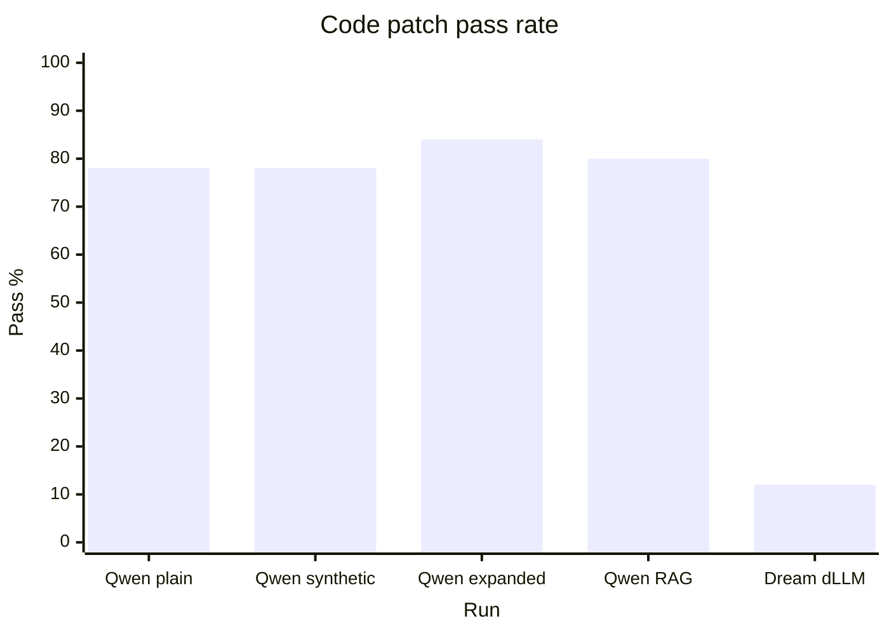
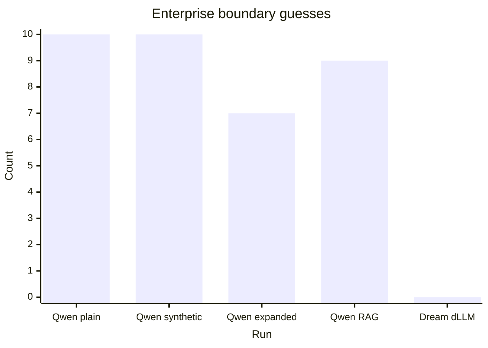
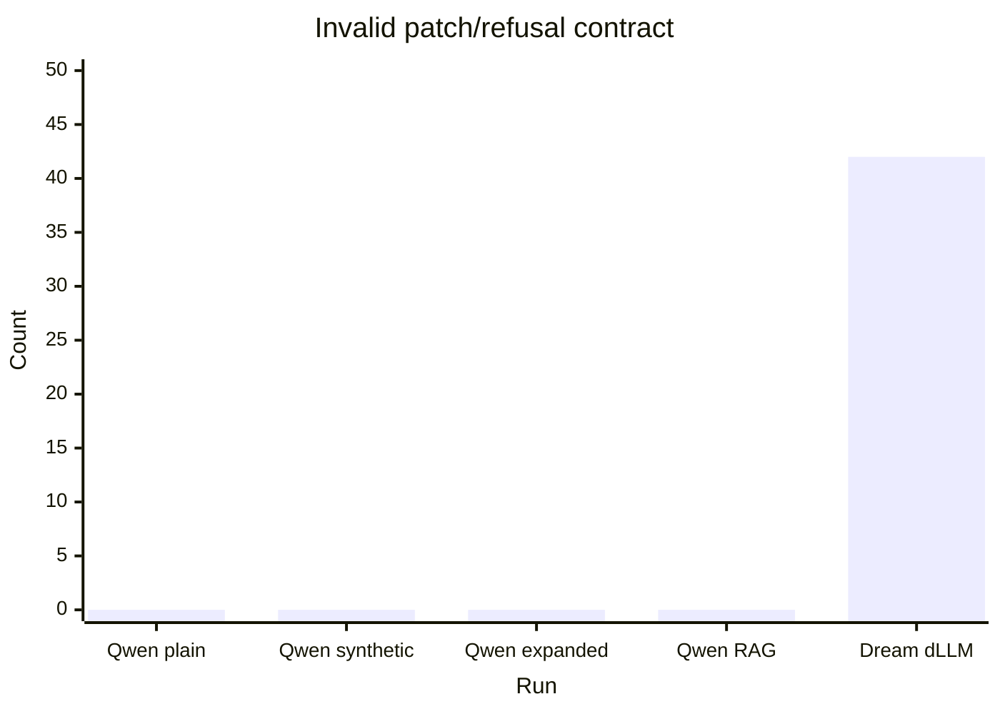
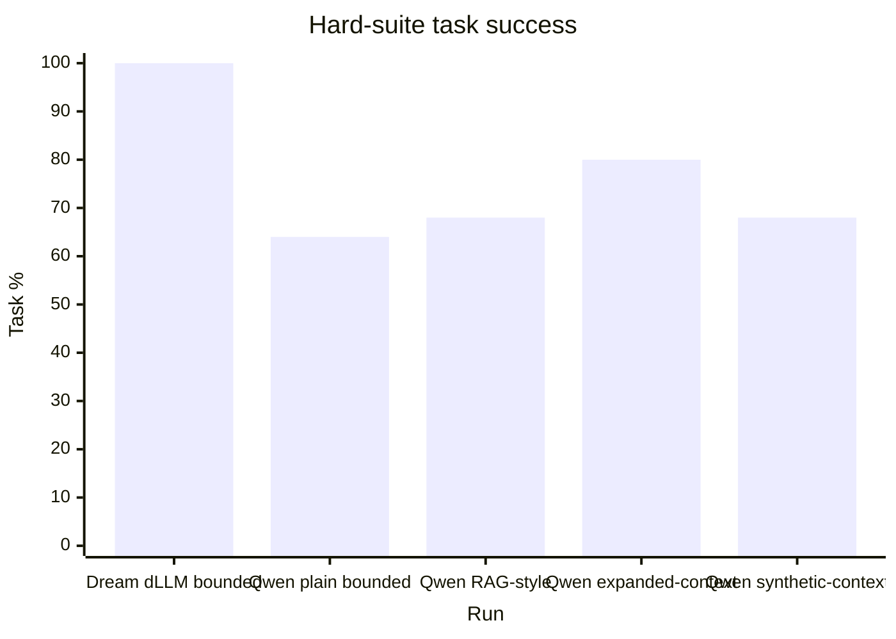
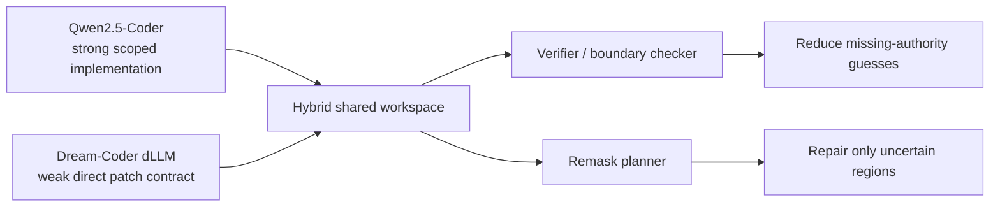

# First Milestone Benchmark Figures

This document turns the first milestone benchmark artifacts into a stable,
GitHub-readable figure page.

Source artifacts:

- `reports/2026-06-19T22-16-54-830Z-code-failure-taxonomy.json`
- `reports/2026-06-19T17-13-22-998Z-llm-context-comparison.json`
- `reports/2026-06-19T22-33-21-315Z-research-figures.md`

These figures are visual aids. The canonical raw measurements remain in the
benchmark JSON/Markdown artifacts and in `docs/INITIAL_RESULTS.md`.

## Figure 1: Code Patch Pass Rate



| Run | Patch pass | Refusal | Boundary guess | Invalid contract |
| --- | ---: | ---: | ---: | ---: |
| Qwen plain | 78% | 80% | 10 | 0 |
| Qwen synthetic | 78% | 80% | 10 | 0 |
| Qwen expanded | 84% | 86% | 7 | 0 |
| Qwen RAG | 80% | 82% | 9 | 0 |
| Dream dLLM | 12% | 80% | 0 | 42 |

Reading:

Qwen2.5-Coder is a strong scoped implementation candidate in this benchmark.
Dream-Coder dLLM direct patching is weak because the worker often fails to emit
a machine-readable patch/refusal contract.

## Figure 2: Enterprise Boundary Guess Count



Reading:

Lower is better. Boundary guess means the model should refuse because authority
or context is missing, but it guessed or edited anyway.

The key result is that Qwen2.5-Coder can write patches, but often does not know
when it should stop in enterprise-boundary cases. Expanded context helped but did
not solve the problem.

## Figure 3: Invalid Machine-Readable Contract Count



Reading:

Lower is better. Invalid contract means the model did not produce a
machine-applicable patch or refusal object.

This separates Dream-Coder dLLM's current direct-patch weakness from Qwen's
boundary weakness. They are not failing in the same way.

## Figure 4: Behavior Benchmark Task Success



| Run | Task | Evidence | Trace | Budget used |
| --- | ---: | ---: | ---: | ---: |
| Dream dLLM bounded | 100% | 100% | 100% | 28.1% |
| Qwen plain bounded | 64% | 96% | 96% | 28.1% |
| Qwen RAG-style | 68% | 84% | 84% | 40.6% |
| Qwen expanded-context | 80% | 52% | 52% | 50.3% |
| Qwen synthetic-context | 68% | 96% | 96% | 39.6% |

Reading:

Task success, evidence, and trace must be read together. A run can answer more
often while becoming less auditable. Expanded context improved task success in
the behavior benchmark but reduced evidence and trace completeness.

## Figure 5: Research Direction



Reading:

The first phase does not prove that one model replaces another. It suggests a
role-specialized hybrid architecture:

- Qwen2.5-Coder as implementation agent.
- dLLM-style worker as verifier, boundary checker, critique agent, or remask
  planner.
- Shared workspace as the coordination layer.

## First Milestone Interpretation

The first milestone supports this careful conclusion:

```text
The problem is not only whether a model can write code. The problem is whether
an agentic coding architecture can write code while respecting scope, authority,
boundary, refusal, and traceability constraints.
```

The next experiment should test whether a dLLM-style verifier/remask layer can
reduce Qwen2.5-Coder's enterprise-boundary guesses without weakening its scoped
implementation strength.
