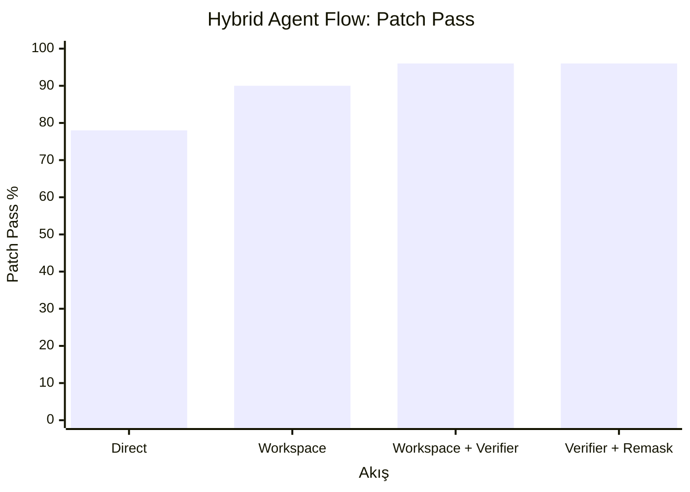
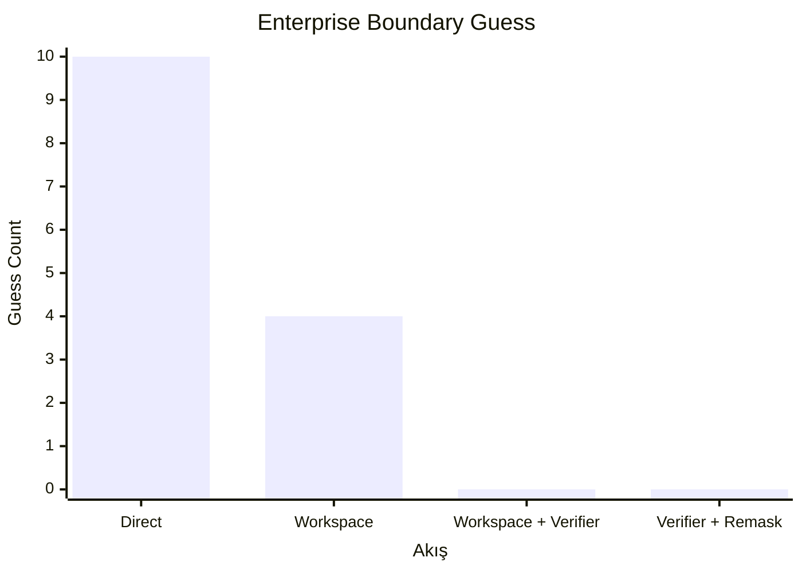
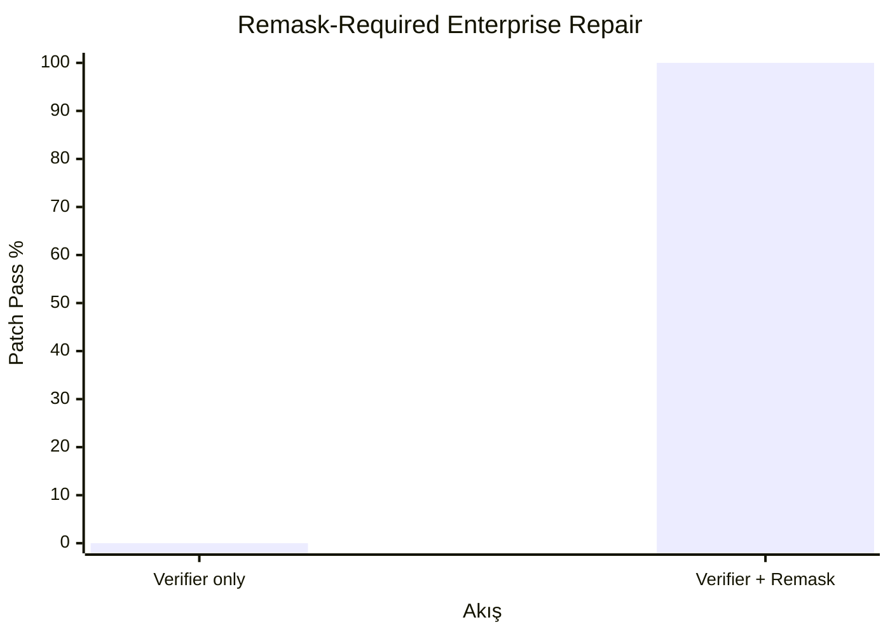

# LinkedIn İçin Kısa Grafikler

Bu dosya, LinkedIn paylaşımı veya sunum için sadeleştirilmiş grafik ve tabloları
içerir. Ana teknik rapor: [`../RESEARCH_REPORT_TR.md`](../RESEARCH_REPORT_TR.md).

## Grafik 1: Aynı Model, Farklı Agent Akışı



| Akış | Patch Pass | Boundary Guess |
| --- | ---: | ---: |
| Direct Qwen2.5-Coder | 78% | 10 |
| Workspace | 90% | 4 |
| Workspace + Verifier | 96% | 0 |
| Workspace + Verifier + Remask | 96% | 0 |

Kısa okuma:

```text
Model aynı kaldı. Agent mimarisi değişince patch pass arttı ve boundary guess
10'dan 0'a indi.
```

## Grafik 2: Boundary Guess Azalımı



Kısa okuma:

```text
Verifier katmanı, eksik yetki veya eksik karar durumunda modelin tahmin ederek
patch üretmesini engelledi.
```

## Grafik 3: Remask-Required Repair



| Akış | Patch Pass | Missing Expected File | Required Content Miss |
| --- | ---: | ---: | ---: |
| Verifier only | 0% | 8 | 8 |
| Verifier + Remask | 100% | 0 | 0 |

Kısa okuma:

```text
Verifier kaliteyi korudu; remask eksik paired-file patch bölgesini tamir ederek
üretkenliği geri kazandırdı.
```

## Tek Cümlelik Sonuç

```text
Agentic coding güvenilirliği yalnızca model kalitesiyle değil; workspace,
verifier ve hedefli remask mimarisiyle de belirleniyor.
```
